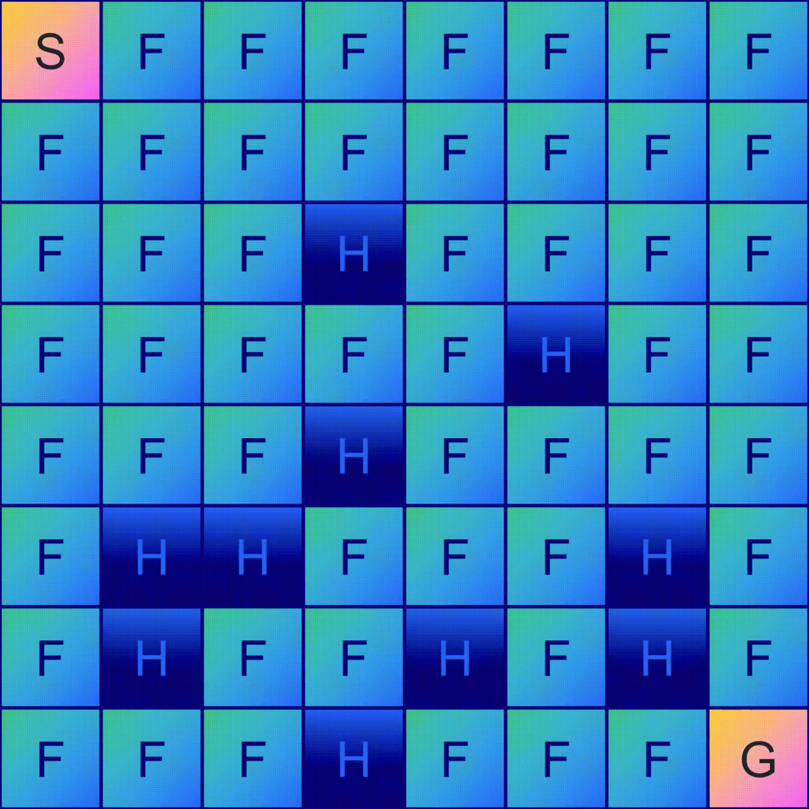

# Solving Frozen Lake Problem with Q-learning

Please read the [report](Report.pdf) for details. 

  

  <i>8x8 Frozen Lake</i>

## Introduction
This project implements a Q-learning algorithm to solve the Frozen Lake problem, a classic reinforcement learning challenge. The primary goal is to navigate across a 4x4 and an 8x8 grid representing a frozen lake, avoiding falling into holes and reaching a goal safely. The project emphasizes the importance of the exploration-exploitation trade-off in reinforcement learning, particularly comparing the performance of linear and exponential decay methods in this context.

## Methodology
The environment is a grid (4x4 and 8x8) with a start point, goal, safe areas (frozen), and dangerous areas (holes). The Q-learning algorithm, with a maintained Q-table, is used to find optimal paths from start to goal. Key parameters include a learning rate of 0.5 and a discount factor of 0.9. The project explores how different methods of epsilon decay (linear vs. exponential) impact the learning process and the efficiency of finding optimal solutions.

## Results
The results highlight the effectiveness of the exploration-exploitation trade-off in Q-learning. It was observed that the exponential decay method outperforms linear decay in terms of training efficiency and solution optimality, especially in complex environments like the 8x8 grid. The study provides insights into how adjusting the rate of exploration and exploitation can significantly affect the performance of a reinforcement learning agent.

## Conclusion
The Q-Learning Frozen Lake Solver successfully demonstrates the application of Q-learning in navigating a grid-based environment. The study underscores the significance of exploration-exploitation trade-off and provides a comparative analysis of decay methods, advocating for the effectiveness of exponential decay in certain scenarios.

### Appendix
* Detailed Q-tables for different decay methods.
* Graphical representations of training outcomes and performance comparisons.

---

### Usage

Install OpenAI gym (pip or conda)

- `pip install gym`
- `conda install -c conda-forge gym`

Install seaborn (pip or conda)

- `pip install seaborn`
- `conda install seaborn`

